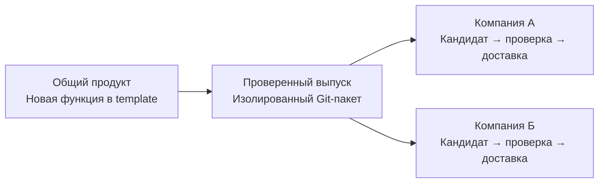

# Рабочая система компании

**Версия 1.3.1** · файловая память · агенты · общий Git

Переносимый шаблон для команды: задачи, правила, источники и результаты лежат в понятных местах. Агент находит нужный метод по карте, выполняет разрешённую работу, проверяет её и сохраняет общую версию.

[Схемы для команды](template/docs/company-system-guide.html) · [Карта компании](template/company/README.md) · [Выпуск и обновление](docs/development/RELEASE.md) · [Разработка](docs/development/README.md)

У каждой компании сохраняются свои данные, настройки и местные решения. Новые функции передаются через проверенный выпуск; применение выполняется отдельно для выбранной компании. Внутренние заметки разработки остаются в продукте.

## Версии

| Выпуск | Что изменилось |
| --- | --- |
| **1.3.1** | Company Organization: read-only сверка путей, карт, ссылок и закреплённых потребителей; безопасный перенос через exact pre/postimage без автоперемещений из hooks |
| 1.3.0 | Настройка окружения без Python; общий runtime для Windows/WSL2/macOS/Linux; точные bytes, переносимое восстановление и тонкие адаптеры |
| 1.2.0 | Пакетная проверка экспортируемой Git-истории; точные зависимости задач; шесть локальных хуков и переносимые настройки двух сред |
| 1.1.5 | Проверка источников аналитики и сохранённой истории; окончательная отмена; изоляция Git; восстановление кэша и прерванного обновления |
| 1.1.4 | Переносимый пакет обновления одной командой; маршрут новой функции из продукта в компанию; проверка передачи нового навыка и программы |
| 1.1.3 | Читаемость и отступы визуального руководства, системный шрифт |
| 1.1.2 | Руководство со схемами; согласованные рецепты навыков без лишних повторов |
| 1.1.1 | Соразмерные проверки; доставка законченной задачи; повторные синки уточнений исключены |
| 1.1.0 | Безопасная проверка общей версии в начале самостоятельной задачи |
| 1.0.0 | Полный локальный комплект: память и карты, бизнес-блоки, стандарты и навыки, процессы, проверки, API/MCP, Git, граф и развитие компаний |

Хуки по умолчанию выключены. Общий CLI и оба протокола проверяются локально; native trust/events и live аккаунты требуют собственного подтверждения.

Runtime проверен на Ubuntu24.04 x64, macOS14 ARM64 и WindowsServer2022 x64; WSL2 проверяется отдельно. Точные границы — в профилях среды.

Первый запуск на новой машине: [подготовка среды](template/adapters/README.md). Native skills/hooks и доступ к аккаунтам проверяются отдельно от runtime ОС.

Источник текущего номера — [release.yaml](template/release.yaml). Подробности проверок, ошибки и границы native/live находятся в [плане продукта](docs/development/PLAN.md) и его задаче.

## Порядок чтения

1. [AGENTS.md](AGENTS.md) — правила разработки и сохранения результата.
2. [Карта разработки](docs/development/README.md) → [PLAN](docs/development/PLAN.md) → соответствующая задача.
3. [RELEASE](docs/development/RELEASE.md) — выпустить функцию, передать пакет и подготовить обновление компании.

Канонический комплект компании — **template/**. Документы разработки — **docs/development/**. Репозиторий продукта: [ArtemArzi/company-work-system](https://github.com/ArtemArzi/company-work-system), публичный.
